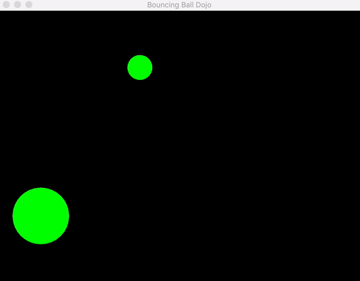
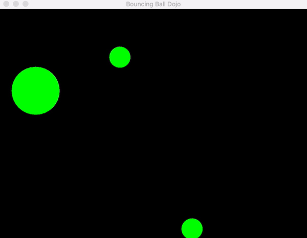

# Bouncing Ball


## Getting Started

### Setup code locally
1. Import this folder with Intellij as an Gradle project

### Run the Application
1. Go to `BouncingBall` folder
2. Type ```./gradlew run``` on console or run `ball.BallApp` class on IntelliJ
3. Run tests on IntelliJ

## Overview of the application

The initial state of this dojo is that we have a `BouncingBall` and an `ElasticBall`. It is not possible for a ball to be elastic and bouncy at the same time.



Our goal is to refactor this code so that the ball can be elastic, bouncy or both.



During the dojo, we first tried to do this using inheritance. We can extend `BouncingBall` or `ElasticBall` to try and create our `ElasticBouncingBall`, but we can't extend both (this is a constraint of the language, see further reading for details). As a result, if we use inheritance to create an `ElasticBouncingBall`, we will have to have duplicate logic.

Inheritance is an __is-a__ relationship. In our initial design, BouncingBall __is-a__ Ball.

But what if we used composition instead of inheritance? Composition is a __has-a__ relationship. A bouncing ball actually is a Ball that __has-a__ Bouncing behaviour. This way, a Ball can have many behaviours (such as Elastic, Bouncing, or Swinging).

Refactor the baseline implementation so that we only have one Ball object that can have many Behaviours (`Behaviour` will be an interface). Then make Elastic and Bouncing implementations of the Behaviour interface. That way we can create a Ball with either of the Behaviours, both, or even none of the Behaviours.

*IMPORTANT: There are a few areas of the code that you don't be worry about, namely the __Swing UI code__. This dojo is NOT about learning Swing or learning how to code complex animations. It is a design challenge. Becaude of that, there are some "DO NOT CHANGE" comments in the code. You are free to move the code around as they need, but don't waste time trying to figure out the rendering logic.*

## Further Reading

[Wikipedia: Composition over Inheritance](https://en.wikipedia.org/wiki/Composition_over_inheritance)

[Composition vs Inheritance? ThoughtWorks Insights](https://www.thoughtworks.com/insights/blog/composition-vs-inheritance-how-choose)

[Wikipedia: Multiple Inheritance](https://en.wikipedia.org/wiki/Multiple_inheritance)
